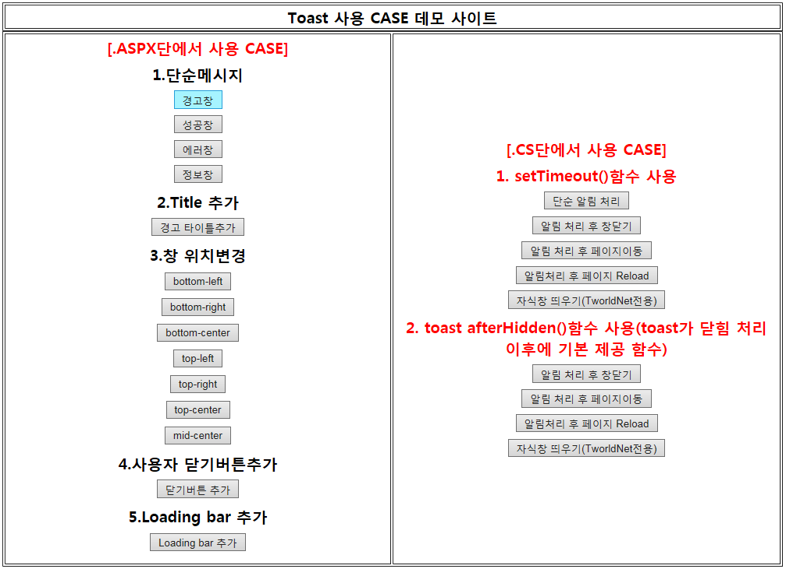

# Toast ASP.NET Sample 
Toast Notification ASP.NET Sample <br>
by Use [Kamran Ahmed](http://kamranahmed.info/toast) <br>


# Dependencies
- jquery >= 1.6.3

# How to use

- You can directly download the repository(.zip)

# Demo Site 

- Main.aspx

## Code
**1. javascript function(ToastAlert.js)**
```javascript
var callpara, callurl;
function toastify(type, msg, title, position, showclosebutton, loader, calltype, url) {

    $.toast().reset('all');
    var icontype, toastlocation, closebutton, loaderUse;
    if (type == null || type == '') {
        icontype = 'success';
    }
    else {
        icontype = type;
    }
    if (position == null || position == '') {
        toastlocation = 'mid-center';
    }
    else {
        toastlocation = position;
    }
    if (showclosebutton == null || showclosebutton == '' || showclosebutton == 'false') {
        closebutton = false;
    }
    else {
        closebutton = true;;
    }
    if (loader == null || loader == '' || loader =='false') {
        loaderUse = false;
    }
    else {
        loaderUse = true;
    }

    callpara = calltype;
    callurl = url;

    $.toast({
        text: msg, // 보여줄 메시지 내용
        heading: title,  // 보여줄 타이틀 내용
        icon: icontype, // icon type (warning,Success,Error,Information 중 선택)
        showHideTransition: 'fade', // 창이 나타나는 효과(fade, slide, plain 중 선택)
        allowToastClose: closebutton, // 사용자 닫기 버튼(x)를 사용할지 여부
        hideAfter: 1500, //false처리 할 경우 sticky 형태로 자동 닫힘이 안되며, ms단위로 넣을 경우 ms 후에 자동으로 창이 사라짐
        stack: false, // false처리 할 경우 한번에 하나의 창만 나타나며, 숫자를 넣을 경우 최대 창 갯수를 나타냄
        position: toastlocation, //창 위치(bottom-left, bottom-right, bottom-center,top-left,top-right,top-center,mid-center, 사용자 정의값(left, right, top, bottom) 중 선택)
        textAlign: 'left',  // 메시지 정렬 위치(left, right or center 중 선택)
        loader: loaderUse,  // loader bar를 보여줄지 말지 여부(기본값: true)
        loaderBg: '#9EC600',  // // loader bar 색
        beforeShow: function () { }, // toast가 메세지 보여주기 전에 이벤트
        afterShown: function () { }, // toast가 메세지 보여준 이후에 이벤트
        beforeHide: function () { }, // toast가 닫힘 처리 전에 이벤트
        afterHidden: function () {
            switch (callpara ? callpara = ToUpper(callpara) : callpara)
            {
                case "CLOSEWINDOW":
                    window.opener='nothing'; window.open('','_parent','');window.close();
                    break;
                case "CHANGELOCATION":
                    location.href = callurl;
                    break;
                case "RELOAD":
                    location.href = location.href;
                    break;
                case "CLOSERELOAD":
                    window.close();
                    break;
            }
        }   // toast가 닫힘 처리 이후에 이벤트
    });
}
```
**2. .aspx toast case**
```javascript
// Sample fucntion
 function Fn_AspxNoti(type, msg, title, position, showclosebutton, loader) {
            toastify(type, 'Toast창 테스트입니다.', title, position, showclosebutton, loader);
        }
// 1.Messages with icons
<input type="button" onclick="Fn_AspxNoti('warning');" value="경고창" />
// 2.Specifying the heading of toast message
<input type="button" onclick="Fn_AspxNoti('warning',null,'경고');" value="경고 타이틀추가" />
// 3.Positioning the toast
<input type="button" onclick="Fn_AspxNoti('warning', null, '경고','bottom-left');" value="bottom-left" />
// 4.Making the toast closeable or not
 <input type="button" onclick="Fn_AspxNoti('warning', null, '경고',null,true);" value="닫기버튼 추가" />
// 5.Showing the loading bar
<input type="button" onclick="Fn_AspxNoti('warning', null, '경고', null, null,true);" value="Loading bar 추가" />
```

**3. .cs toast case**
```javascript
// Common Class(MessageBox.cs)
public static class MessageBox
    {
        public static void Message(this Page Page, String Type, String Message, String Title, String Position, Boolean ShowCloseButton, Boolean Loader)
        {
            Page.ClientScript.RegisterClientScriptBlock(
              Page.GetType(),
              "MessageBox",
              "toastify('" + Type + "','" + Message + "','" + Title + "','" + Position + "',"+ShowCloseButton.ToString().ToLower()+","+Loader.ToString().ToLower()+");",
              true
           );
        }


        public static void MessageAndCloseWindow(this Page Page, String Type, String Message, String Title, String Position, Boolean ShowCloseButton, Boolean Loader)
        {
            Page.ClientScript.RegisterClientScriptBlock(
              Page.GetType(),
              "MessageBox",
              "toastify('" + Type + "','" + Message + "','" + Title + "','" + Position + "'," + ShowCloseButton.ToString().ToLower() + "," + Loader.ToString().ToLower() + ");setTimeout(function(){window.opener='nothing'; window.open('','_parent','');window.close();},1000);",
              true
           );
        }

        public static void MessageAndChangeLocation(this Page Page, String Type, String Message, String Title, String Position, Boolean ShowCloseButton, Boolean Loader,String Url)
        {
            Page.ClientScript.RegisterClientScriptBlock(
              Page.GetType(),
              "MessageBox",
              "toastify('" + Type + "','" + Message + "','" + Title + "','" + Position + "'," + ShowCloseButton.ToString().ToLower() + "," + Loader.ToString().ToLower() + ");setTimeout(function(){ location.href  = '" + Url + "'; },1000);",
              true
           );
        }

        public static void MessageAndReload(this Page Page, String Type, String Message, String Title, String Position, Boolean ShowCloseButton, Boolean Loader)
        {
            Page.ClientScript.RegisterClientScriptBlock(
              Page.GetType(),
              "MessageBox",
              "toastify('" + Type + "','" + Message + "','" + Title + "','" + Position + "'," + ShowCloseButton.ToString().ToLower() + "," + Loader.ToString().ToLower() + ");setTimeout(function(){location.href=location.href;},1000);",
              true
           );
        }

        //TworldNet
        public static void CloseWindowAndParentReloadAsync_TWorldNet(this Page Page, String Type, String Message, String Title, String Position, Boolean ShowCloseButton, Boolean Loader)
        {
            Page.ClientScript.RegisterClientScriptBlock(
              Page.GetType(),
              "MessageBox",
              "opener.location.href = opener.location.href.replace('NoticeType','Expired');toastify('" + Type + "','" + Message + "','" + Title + "','" + Position + "'," + ShowCloseButton.ToString().ToLower() + "," + Loader.ToString().ToLower() + "); setTimeout(function () {window.close();},1000);",
              true
           );
        }


        public static void MessageAndCloseWindowCallBack(this Page Page, String Type, String Message, String Title, String Position, Boolean ShowCloseButton, Boolean Loader)
        {
            Page.ClientScript.RegisterClientScriptBlock(
              Page.GetType(),
              "MessageBox",
              "toastify('" + Type + "','" + Message + "','" + Title + "','" + Position + "'," + ShowCloseButton.ToString().ToLower() + "," + Loader.ToString().ToLower() + ",'CLOSEWINDOW');",
              true
           );
        }

        public static void MessageAndChangeLocationCallBack(this Page Page, String Type, String Message, String Title, String Position, Boolean ShowCloseButton, Boolean Loader, String Url)
        {

            Page.ClientScript.RegisterClientScriptBlock(
             Page.GetType(),
             "MessageBox",
             "toastify('" + Type + "','" + Message + "','" + Title + "','" + Position + "'," + ShowCloseButton.ToString().ToLower() + "," + Loader.ToString().ToLower() + ",'CHANGELOCATION','" + Url + "');",
             true
          );
        }

        public static void MessageAndReloadCallBack(this Page Page, String Type, String Message, String Title, String Position, Boolean ShowCloseButton, Boolean Loader)
        {
            Page.ClientScript.RegisterClientScriptBlock(
              Page.GetType(),
              "MessageBox",
              "toastify('" + Type + "','" + Message + "','" + Title + "','" + Position + "'," + ShowCloseButton.ToString().ToLower() + "," + Loader.ToString().ToLower() + ",'RELOAD');",
              true
           );
        }

        //TworldNet
        public static void CloseWindowAndParentReloadAsync_TWorldNetCallBack(this Page Page, String Type, String Message, String Title, String Position, Boolean ShowCloseButton, Boolean Loader)
        {
            Page.ClientScript.RegisterClientScriptBlock(
              Page.GetType(),
              "MessageBox",
              "opener.location.href = opener.location.href.replace('NoticeType','Expired');toastify('" + Type + "','" + Message + "','" + Title + "','" + Position + "'," + ShowCloseButton.ToString().ToLower() + "," + Loader.ToString().ToLower() + ",'CLOSERELOAD');",
              true
           );
        }


    }
//setTimeout()함수 사용
// 1. Messages with icons
<asp:Button ID="btnNotice_Basic" runat="server" Text="단순 알림 처리" OnClick="btnNotice_Basic_Click" />
 protected void btnNotice_Basic_Click(object sender, EventArgs e)
 {
     MessageBox.Message(this.Page,"success","정상적으로 저장되었습니다",null,null,false,false);
 }
// 2. Message and Close
<asp:Button ID="btnNotice_Close" runat="server" Text="알림 처리 후 창닫기" OnClick="btnNotice_Close_Click" />
protected void btnNotice_Close_Click(object sender, EventArgs e)
{
    MessageBox.MessageAndCloseWindow(this.Page, "success", "정상적으로 저장되었습니다", null, null, false, false);
}
// 3. Message and ChangeLocation
<asp:Button ID="btnNotice_Change" runat="server" Text="알림 처리 후 페이지이동" OnClick="btnNotice_Change_Click" />
protected void btnNotice_Change_Click(object sender, EventArgs e)
{
    MessageBox.MessageAndChangeLocation(this.Page, "success", "정상적으로 저장되었습니다", null, null, false, false,"Login.aspx");
}
// 4. Message and Reload
<asp:Button ID="btnNotice_Reload" runat="server" Text="알림처리 후 페이지 Reload" OnClick="btnNotice_Reload_Click" />
 protected void btnNotice_Reload_Click(object sender, EventArgs e)
 {
    MessageBox.MessageAndReload(this.Page, "success", "정상적으로 저장되었습니다", null, null, false, false);
 }
 // 5. Message and Close and Parent Reload
 <input type="button" onclick="fn_Popup();" value="자식창 띄우기(TworldNet전용)" />
 function fn_Popup() {

            window.open('Popup.aspx', '', ' width=900,height=800,scrollbars=yes,resizeable=no,left=150,top=150');
        }
.Popup.aspx
<asp:Button ID="btnNotice_TworldNet" runat="server" Text="알림처리 후 창닫히고 부모창 Reload(CloseWindowAndParentReloadAsync_TWorldNet)" OnClick="btnNotice_TworldNet_Click" />
 protected void btnNotice_TworldNet_Click(object sender, EventArgs e)
        {
             MessageBox.CloseWindowAndParentReloadAsync_TWorldNet(this.Page, "success", "정상적으로 저장되었습니다", null, null, false, false);
        }

// toast afterHidden()함수 사용(toast가 닫힘 처리 이후에 기본 제공 함수)
// 1. Message and Close
<asp:Button ID="btnNotice_CallBack" runat="server" Text="알림 처리 후 창닫기" OnClick="btnNotice_CallBack_Close_Click" />
 protected void btnNotice_CallBack_Close_Click(object sender, EventArgs e)
        {
            MessageBox.MessageAndCloseWindowCallBack(this.Page, "success", "정상적으로 저장되었습니다", null, null, false, false);
        }
// 2. Message and ChangeLocation
   <asp:Button ID="btnNotice_Change_CallBack" runat="server" Text="알림 처리 후 페이지이동" OnClick="btnNotice_Change_CallBack_Click" />
    protected void btnNotice_Change_CallBack_Click(object sender, EventArgs e)
        {
            MessageBox.MessageAndChangeLocationCallBack(this.Page, "success", "정상적으로 저장되었습니다", null, null, false, false, "Login.aspx");
        }
// 3.  Message and Reload
<asp:Button ID="btnNotice_Reload_CallBack" runat="server" Text="알림처리 후 페이지 Reload" OnClick="btnNotice_Reload_CallBack_Click" />
                                            </td>
  protected void btnNotice_Reload_CallBack_Click(object sender, EventArgs e)
        {
            MessageBox.MessageAndReloadCallBack(this.Page, "success", "정상적으로 저장되었습니다", null, null, false, false);
        }
// 4. Message and Close and Parent Reload
<input type="button" onclick="fn_Popup();" value="자식창 띄우기(TworldNet전용)" />
 function fn_Popup() {

            window.open('Popup.aspx', '', ' width=900,height=800,scrollbars=yes,resizeable=no,left=150,top=150');
        }
.Popup.aspx
<asp:Button ID="btnNotice_TworldNet_CallBack" runat="server" Text="2. 알림처리 후 창닫히고 부모창 Reload(CloseWindowAndParentReloadAsync_TWorldNet) toast afterHidden() 함수" OnClick="btnNotice_TworldNet_CallBack_Click" />
protected void btnNotice_TworldNet_CallBack_Click(object sender, EventArgs e)
        {
            MessageBox.CloseWindowAndParentReloadAsync_TWorldNetCallBack(this.Page, "success", "정상적으로 저장되었습니다", null, null, false, false);
        }
```                                   
# Copyright

MIT © DaeJong Kim

